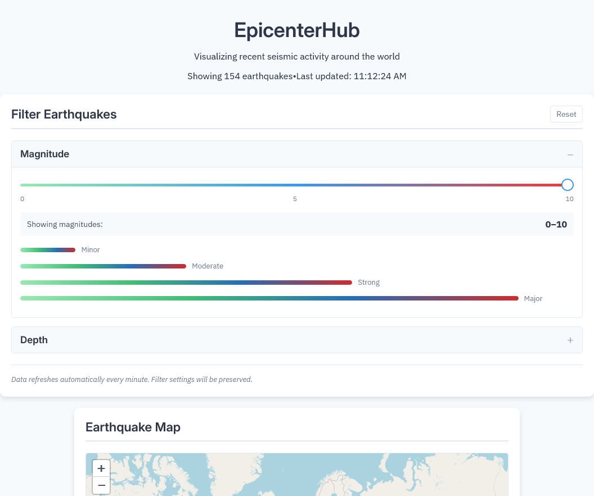

# EpicenterHub 🌍

> A real-time earthquake monitoring dashboard with advanced data visualization powered by React.

<div align="center">

[](https://reactjs.org)
[](https://vitejs.dev)
[](LICENSE)

[Live Demo](https://extraordinary-maamoul-73fb24.netlify.app/) | [Features](#features) | [Tech Stack](#tech-stack) | [Getting Started](#getting-started)

</div>

## Overview

EpicenterHub transforms complex seismic data into visualizations, providing real-time insights into global earthquake activity. This dashboard demonstrates data visualization techniques and is built using USGS data feeds.

## Screenshots


*Landing page*


*Advanced data visualizations and heatmaps*


*Responsive design on mobile devices*

</details>

## Features

🔄 **Real-time Updates**: Automatic refresh every 60 seconds from USGS API  
🗺️ **Interactive Mapping**: Leaflet-powered visualization with color-coded depth indicators  
📊 **Multi-library Charts**: Leveraging the strengths of D3.js, Chart.js, and ApexCharts  
🎨 **Dark Mode**: System preference-aware theme switching  
📱 **Responsive Design**: Fluid layouts from mobile to 4K displays  
⚡ **Performance**: Optimized with React hooks and CSS modules  

### Advanced Visualizations

- **Temporal Analysis**: Area charts tracking quake frequency over time
- **Depth Distribution**: Circular donut chart with 3-tier depth categorization
- **Magnitude Patterns**: D3-powered histogram with statistical overlays
- **Heatmap Analysis**: Hour-by-magnitude activity patterns
- **Custom Filtering**: Dynamic filter controls for depth and magnitude ranges

## Tech Stack

| Technology | Purpose | Highlights |
|------------|---------|------------|
| **React + Vite** | Framework | Fast development, ESM support |
| **Leaflet** | Mapping | Interactive markers with popups |
| **D3.js** | Complex Charts | Custom histogram with animations |
| **Chart.js** | Data Viz | Responsive pie charts |
| **ApexCharts** | Advanced Charts | Heatmaps and area charts |
| **Recharts** | Core Charts | Responsive line & bar charts |
| **CSS Modules** | Styling | Scoped styles, rem-based design |

## Getting Started

### Prerequisites

- Node.js (v18+)
- npm or yarn
- Modern browser with ES6+ support

### Installation

```bash
# Clone the repository
git clone https://github.com/leverh/epicenterhub

# Install dependencies
cd epicenterhub
npm install

# Start development server
npm run dev
```

### Build for Production

```bash
npm run build
npm run preview
```

## Project Structure

```
src/
├── components/
│   ├── AdvancedCharts/
│   │   ├── AreaChart.jsx
│   │   ├── DepthPieChart.jsx
│   │   ├── HeatmapChart.jsx
│   │   └── MagnitudeHistogram.jsx
│   ├── ChartPanel.jsx
│   ├── FilterControls.jsx
│   └── MapView.jsx
├── hooks/
│   ├── useEarthquakeData.js
│   └── useInterval.js
├── styles/
│   ├── App.module.css
│   ├── AdvancedCharts.module.css
│   └── global.css
└── services/
    └── usgsApi.js
```

## Design System

**Typography**: Inter + IBM Plex Sans  
**Colors**: Depth-based gradient (orange → yellow → green)  
**Spacing**: rem-based system (10px root)  

## Data Source

Real-time earthquake data from [USGS GeoJSON Feed](https://earthquake.usgs.gov/earthquakes/feed/v1.0/geojson.php)

## Performance Optimizations

- React.memo for chart components
- useMemo for data processing
- CSS Module scoping
- Lazy loading for advanced charts
- Optimized re-renders with useCallback
  
## License

This project is licensed under the MIT License.

## Contact

Created by [PixelSummit](https://pixelsummit.dev/)

For any inquiries, please contact me directly.

---

<div align="center">
  Made with 💀 using React
</div>